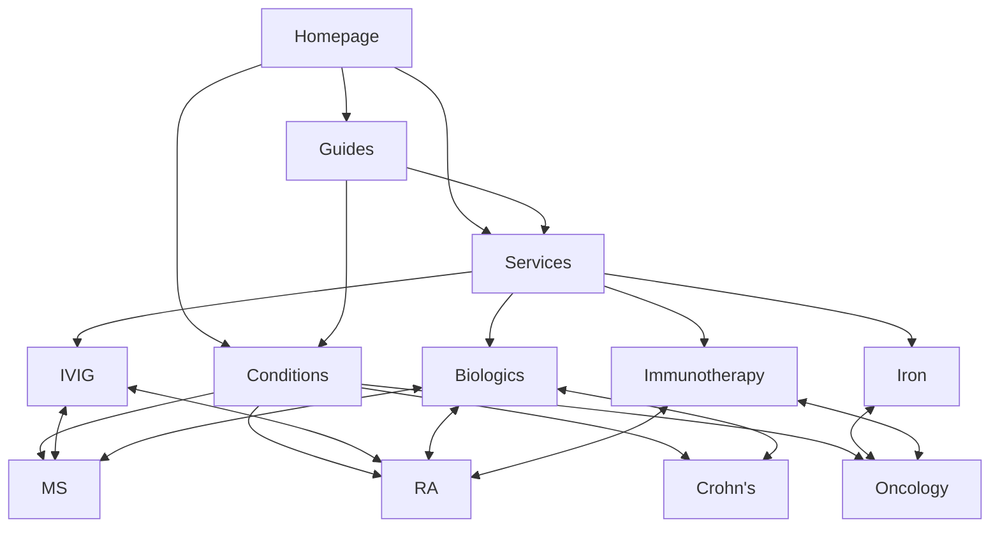

# IV One Health — SEO Strategy Deck

**Prepared by**: CL-SEO-OS  
**Date**: January 2, 2026  
**Deck Depth**: Heavy

---

## Executive Summary

This deck outlines a comprehensive SEO and AEO (Answer Engine Optimization) strategy for IV One Health, a specialized medical infusion clinic in Riyadh, Saudi Arabia.

### Key Strategy Components

| Component | Status | Pages |
|-----------|--------|-------|
| **Services pSEO** | ✅ Enabled | 4 pages |
| **Conditions pSEO** | ✅ Enabled | 4 pages |
| **Locations pSEO** | ❌ Disabled | 0 pages |
| **AEO Guides** | ✅ Enabled | 8 guides |

### Why This Approach

IV One Health operates in a **YMYL (Your Money Your Life)** space where content quality, accuracy, and trustworthiness directly impact search visibility. Our strategy prioritizes:

1. **E-E-A-T compliance** — Experience, Expertise, Authoritativeness, Trust
2. **Physician-focused funnels** — Referral-based model, not patient acquisition
3. **Controlled rollout** — Quality before scale

---

## Part 1: What is Programmatic SEO (pSEO)?

### Definition

Programmatic SEO creates multiple similar pages from a data template, targeting specific search queries at scale.

### How It Works

```
[Template] × [Data Set] = [Multiple Optimized Pages]
```

For IV One Health:

```
Service Template × 4 Services = 4 Service Pages
Condition Template × 4 Conditions = 4 Condition Pages
```

### Why pSEO for Medical Services

| Benefit | Application |
|---------|-------------|
| **Keyword coverage** | Each service/condition has its own target keywords |
| **Internal linking** | Pages cross-link to build topical authority |
| **Scalability** | Add new services/conditions easily |
| **Consistency** | Medical disclaimers applied uniformly |

### What We Built

**Services pSEO (4 pages)**:
- `/services/ivig-infusion`
- `/services/biologic-infusions`
- `/services/iron-infusion`
- `/services/immunotherapy`

**Conditions pSEO (4 pages)**:
- `/conditions/multiple-sclerosis`
- `/conditions/crohns-disease`
- `/conditions/rheumatoid-arthritis`
- `/conditions/oncology`

---

## Part 2: What is Answer Engine Optimization (AEO)?

### The Shift from Search to Answers

Traditional SEO targets "10 blue links." AEO targets:
- Featured snippets
- AI-generated answers (Google SGE, Bing Chat, ChatGPT)
- Voice search responses
- "People Also Ask" boxes

### AEO Content Principles

1. **Direct Answer First** — The answer appears in the first 40 words after the H1
2. **Educational Tone** — No sales language, just helpful information
3. **Structured Format** — Tables, lists, clear headings
4. **FAQ Schema** — Machine-readable Q&A markup

### Why AEO Matters for YMYL

Medical queries increasingly surface AI-generated answers. Being the source of that answer:

- Builds brand authority
- Captures zero-click traffic
- Positions IV One Health as an educational resource
- Create trust before the referral conversation

### What We Built

**8 AEO Guides**:

| Guide Topic | Primary Question |
|-------------|------------------|
| IVIG Therapy | What is IVIG infusion therapy? |
| Biologic Duration | How long does a biologic infusion take? |
| Iron Benefits | What are the benefits of IV iron infusion? |
| Immunotherapy | How does immunotherapy work? |
| MS Treatment | How is MS treated with infusion therapy? |
| Crohn's & Biologics | Can Crohn's be managed with biologics? |
| RA Options | What infusion options exist for RA? |
| Oncology Support | How does infusion therapy support oncology patients? |

---

## Part 3: Site Architecture

### URL Taxonomy

```
ivonehealth.com/
├── services/
│   ├── ivig-infusion
│   ├── biologic-infusions
│   ├── iron-infusion
│   └── immunotherapy
├── conditions/
│   ├── multiple-sclerosis
│   ├── crohns-disease
│   ├── rheumatoid-arthritis
│   └── oncology
├── guides/
│   ├── what-is-ivig-infusion-therapy
│   ├── how-long-does-biologic-infusion-take
│   ├── benefits-of-iv-iron-infusion
│   ├── how-does-immunotherapy-work
│   ├── how-is-ms-treated-with-infusion-therapy
│   ├── can-crohns-be-managed-with-biologics
│   ├── infusion-options-for-rheumatoid-arthritis
│   └── infusion-therapy-for-oncology-patients
└── contact
```

### Internal Linking Strategy



**Link Flow**:
- Services ↔ Related Conditions (bidirectional)
- Guides → Services and Conditions (one-way, supportive)
- Homepage → All sections

---

## Part 4: Tradeoff Justifications

### Why Locations pSEO is Disabled

The config specified `enableLocationsPSEO: "auto"` with `hasMultipleLocations: false`.

**Decision**: Auto-resolved to **disabled**.

| Factor | Analysis |
|--------|----------|
| **Single location** | Only one clinic in Riyadh |
| **No invented locations** | `doNotInventLocations: true` constraint |
| **Thin content risk** | Multiple location pages without real locations = spam signal |
| **YMYL sensitivity** | Medical sites face higher thin content penalties |

**Alternative**: Location anchored in footer and contact page.

---

### Why Referral-Only CTAs

The config specified `referralBased: true`.

**Decision**: All CTAs target physicians, not patients.

| Element | Standard CTA | Our CTA |
|---------|-------------|---------|
| Service pages | "Book Now" | "Contact our clinical team" |
| Condition pages | "Schedule Appointment" | "Physician referral required" |
| Guides | "Get Started" | "Learn more" (soft) |

**Rationale**:
- Matches business model
- Complies with medical advertising regulations
- Builds physician trust, not patient impulse

---

### Why Controlled Rollout

The config specified `rolloutMode: "controlled"`.

**Indexing Strategy**:

| Phase | Pages | Timing |
|-------|-------|--------|
| **Immediate** | Homepage, Core Services, Contact | Week 1 |
| **Week 2-3** | Condition pages | After indexing confirmation |
| **Week 4+** | AEO Guides | After authority established |
| **Ongoing** | Monitor and adjust | Based on GSC data |

**Why Not Aggressive**:
- YMYL sites require trust before scale
- Google evaluates authority over time
- Controlled rollout prevents "thin content" signals
- Allows correction before amplification

---

## Part 5: YMYL Compliance

### What is YMYL?

"Your Money Your Life" — Google's classification for content that could impact:
- Health and safety
- Financial stability
- Major life decisions

Medical content is **high YMYL**. Quality requirements are stricter.

### Our Compliance Measures

| Requirement | Implementation |
|-------------|----------------|
| **Medical disclaimers** | Every page opens with disclaimer block |
| **No diagnostic claims** | Content describes, doesn't diagnose |
| **Physician authority** | All treatment requires referral |
| **Educational tone** | AEO guides are informational only |
| **No sales in guides** | `noSalesLanguageInGuides: true` enforced |

### Example Disclaimer Block

> **Medical Disclaimer**: This information is for educational purposes only. All treatments at IV One Health are administered under physician supervision and require a medical referral.

---

## Part 6: Schema Markup

### Organization Schema

```json
{
  "@type": "MedicalBusiness",
  "name": "IV One Health",
  "url": "https://ivonehealth.com",
  "medicalSpecialty": ["InfusionTherapy"],
  "availableService": [...]
}
```

### Service Page Schema

```json
{
  "@type": "MedicalTherapy",
  "name": "IVIG Infusion",
  "provider": {"@type": "MedicalBusiness", "name": "IV One Health"}
}
```

### Condition Page Schema

```json
{
  "@type": "MedicalCondition",
  "name": "Multiple Sclerosis",
  "possibleTreatment": [...]
}
```

### FAQ Schema (Guides)

```json
{
  "@type": "FAQPage",
  "mainEntity": [
    {"@type": "Question", "name": "...", "acceptedAnswer": {...}}
  ]
}
```

---

## Part 7: Rollout Roadmap

### Phase 1: Foundation (Week 1)
- [ ] Deploy service pages (4)
- [ ] Deploy condition pages (4)
- [ ] Apply schema markup
- [ ] Submit sitemap to GSC
- [ ] Monitor indexing

### Phase 2: Authority Building (Weeks 2-4)
- [ ] Verify core pages indexed
- [ ] Deploy AEO guides (8)
- [ ] Monitor keyword rankings
- [ ] Check for crawl errors

### Phase 3: Optimization (Month 2+)
- [ ] Analyze Search Console data
- [ ] Identify underperforming pages
- [ ] Expand content where warranted
- [ ] Add new services/conditions as business grows

---

## Part 8: Success Metrics

### Primary KPIs

| Metric | Target | Measurement |
|--------|--------|-------------|
| **Indexed pages** | 16/16 | Google Search Console |
| **Organic impressions** | +500% (Month 3) | GSC Performance |
| **Featured snippets** | 2+ guides | GSC/SERP monitoring |
| **Referral inquiries** | Baseline +20% | CRM tracking |

### Secondary KPIs

- Average position for service keywords
- Click-through rate on guide pages
- Time on page (engagement signal)
- Internal link click patterns

---

## Summary

This SEO OS++ build for IV One Health delivers:

✅ **8 pSEO pages** — Services and conditions with cross-linking  
✅ **8 AEO guides** — AI-answer-ready educational content  
✅ **Full schema coverage** — MedicalBusiness, MedicalTherapy, MedicalCondition, FAQ  
✅ **YMYL compliance** — Disclaimers, physician-only CTAs, no claims  
✅ **Controlled rollout** — Authority before scale  
✅ **No invented content** — Only real services, conditions, and location  

**Next Step**: Review this deck and content package, then proceed with deployment.

---

*Generated by CL-SEO-OS | IV One Health Build | January 2026*
